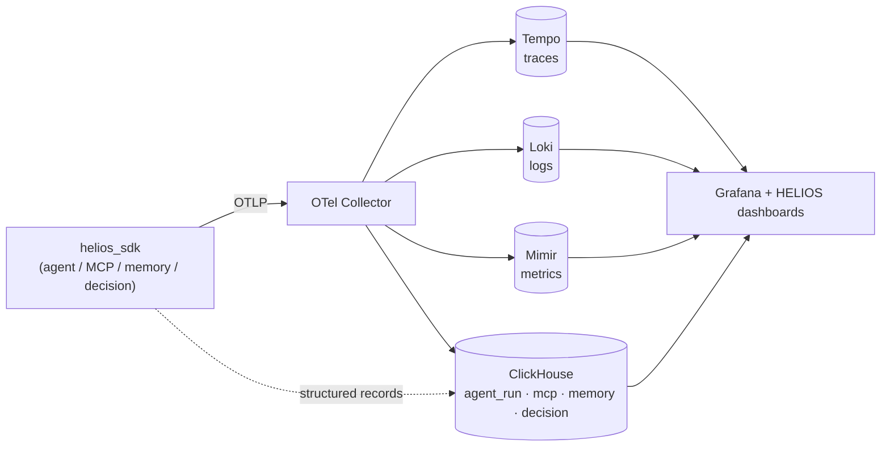

<div align="center">

# HELIOS

### AI SRE for AI Systems — open-source **Agent Runtime Intelligence**

*Understand **why** an agent did what it did: the MCP tool-call chain, the memory
that influenced the decision, and the causal path to the final answer.*

[Quickstart](#quickstart) · [Why HELIOS](#why-helios) · [Architecture](#architecture) · [Tutorial](docs/tutorial-stale-memory.md) · [SDK](sdk-python/README.md)

Apache-2.0 · OpenTelemetry-native · self-hostable in one command

</div>

---

## Why HELIOS

By 2026, the hard question about AI agents is no longer "did the request
succeed?" — it's **"why did the agent behave that way?"**

- Why did costs suddenly double?
- Which retriever (or stale memory) caused the hallucination?
- Which of the 20–50 MCP servers in the chain broke?
- What infrastructure issue caused the AI failure?

Existing tools each cover *one* slice — Grafana (infra), Langfuse (LLM traces),
OpenLLMetry (instrumentation). **No open-source platform unifies infrastructure
telemetry with agent runtime behavior** — MCP calls, memory operations, and the
causal edges between them — in one place. HELIOS does.

V1 focuses on the most differentiated, least-served capability:

| Pillar | What you get |
| --- | --- |
| **MCP Observability** | Full tool-call chains across servers, per-server latency, failure modes, permission-change audit. |
| **Memory Observability** | Read/write/evict operations, provenance, retrieval confidence, and **stale-memory detection** — the prime suspect for wrong answers. |
| **Causal Reconstruction** | Decision edges link `memory → llm → answer`, so you can see the path that produced a result. |
| **OTel-native pipeline** | Drop-in OpenTelemetry; everything is also a standard trace in Tempo. |

> The telemetry pipeline is table stakes. The moat is the **runtime intelligence
> layer** that explains agent behavior.

## Quickstart

**Prerequisites:** Docker (with Compose) and Python 3.10+.

> 📖 Full step-by-step setup — including a fresh device, prerequisites, and
> troubleshooting — is in **[INSTALL.md](INSTALL.md)**.

```powershell
# 1. Start the full stack (collector, ClickHouse, Tempo, Loki, Mimir, Grafana)
#    + seed the demo + run the live agent — one command:
./scripts/quickstart.ps1
```

<details>
<summary>Linux / macOS</summary>

```bash
./scripts/quickstart.sh
```
</details>

<details>
<summary>Manual steps (what the script does)</summary>

```bash
# bring up the containerized stack
cd deploy && docker compose up -d && cd ..

# install the SDK
pip install -e sdk-python

# run the live, offline demo agent (no external LLM calls)
python sdk-python/examples/refund_agent.py
```
</details>

Then open **Grafana** → <http://localhost:3000> → **HELIOS** folder:

- **Why Did the Agent Do That?** — the flagship causal graph
- **MCP Observability** — the tool-call chain
- **Memory Observability** — stale-read detection
- **Agent Runs Overview** — fleet view

➡️ Walk through the full story in the
**[stale-memory tutorial](docs/tutorial-stale-memory.md)**.

## Architecture



One instrumentation, two sinks: every entity is a real OpenTelemetry span
(exported to Tempo) **and** a structured record in ClickHouse that powers the
HELIOS dashboards.

| Component | Role | Port |
| --- | --- | --- |
| OTel Collector | OTLP ingest + fan-out | 4317 / 4318 |
| ClickHouse | Agent Runtime Intelligence store | 8123 / 9000 |
| Tempo / Loki / Mimir | traces / logs / metrics | 3200 / 3100 / 9009 |
| Grafana | dashboards (HELIOS folder) | 3000 |

## Repository layout

| Path | Contents |
| --- | --- |
| [`schema/`](schema/README.md) | The data model: spec, semantic conventions, JSON Schemas, ClickHouse migrations, validation harness. |
| [`deploy/`](deploy/docker-compose.yml) | One-command Docker stack, collector/backends config, Grafana dashboards, seed/smoke scripts. |
| [`sdk-python/`](sdk-python/README.md) | The Python instrumentation SDK + the live demo agent. |
| [`docs/`](docs/tutorial-stale-memory.md) | Tutorials and guides. |

## Project status

V1 (Agent Runtime Intelligence: **OTel + MCP + Memory + Grafana**) is functional
end-to-end. On the roadmap, deliberately sequenced after V1:

- **V2** — AI Ops Copilot / RCA (local-LLM) + evaluations
- **V3** — Business-outcome correlation + multi-tenant control plane
- **V4** — Agent Digital Twin (pre-production simulation)

## Contributing

Contributions welcome — see [CONTRIBUTING.md](CONTRIBUTING.md).

## License

[Apache-2.0](LICENSE).
